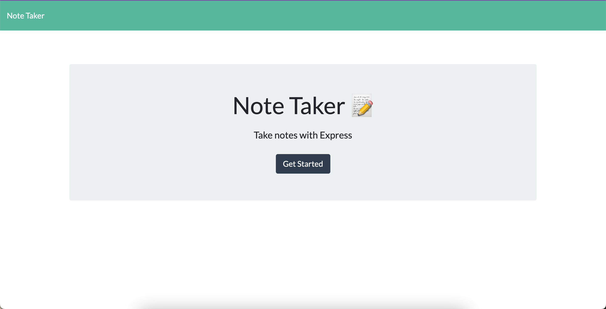

# Note Taking App

[](https://opensource.org/licenses/MIT)

## Description
An Express application that allows users to write and save notes, and also be able to check their previously created notes.

Link to the deployed app: [click here](https://save-a-note-app.herokuapp.com/)

## Screenshots
The landing page of the app:


The note-taking part of the app:


# Table of Contents
* [Installation](#installation)
* [Usage](#usage)
* [License](#license)
* [Contributing](#contributing)
* [Technologies Used](#technologies-used)
* [Code Snippets](#code-snippets)
* [Questions](#questions)
* [User Information](#user-information)

## Installation
To install necessary dependencies, run the following command:
```
npm i
```

## Usage
Install the dependencies and you're ready to go.

## License 
This project is licensed under the MIT license.

## Contributing
Contact me.

## Technologies Used
- Node.js
- Express
- HTML
- JavaScript
- Heroku

## Code Snippets
```javascript
// POST Route that receives a new note, saves it to the db.json file, and returns it to the client
notes.post('/', (req, res) => {
    // Destructuring assignment for the items in req.body
    const { title, text } = req.body;

    // If all the required properties are present
    if (title && text) {
        // Variable for the object we will save
        const newNote = {
            title,
            text,
            id: uuidv4(),
        };

        // Append new note created by the user to our db.json file
        readAndAppend(newNote, './db/db.json');

        const response = {
            status: 'success',
            body: newNote,
        };

        // Sned response back to the client
        res.json(response);
    } else {
        res.json('Error in posting note');
    }
})
```
When the user clicks on the save button after populating the note-taking portion of the front-end, the back-end saves the user's inputs for the title and the text. After ensuring they're both populated, we generate a new note object `newNote` with the title, text, and a randomly generated ID. With this new note, we can append it to our list of notes, which shows on the screen. The user is also able to click on it and it'll populate the page with everything they had written.


## Questions
If you have any questions about the repo, open an issue or contact me directly at laura.sierra17@gmail.com.
You can find more of my work at [laurasierra17](https://www.github.com/laurasierra17).

## User Information
- [LinkedIn](https://www.linkedin.com/in/laurasierra2022)
- [Portfolio](http://www.laura-sierra.com)
